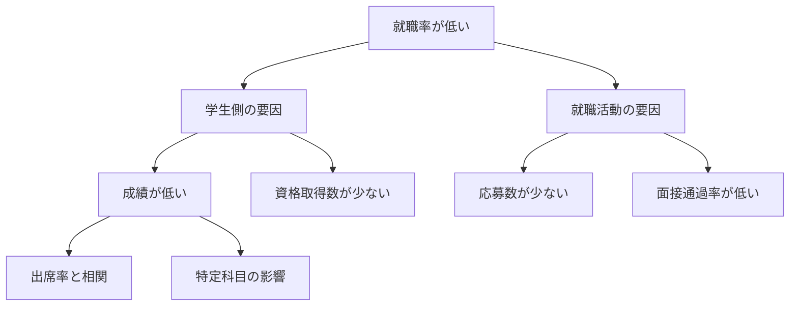

# [コマ7] 分析ストーリーの設計（教科書Ch3 後半）

## 本日の目標
- ロジックツリーで問いを分解できる
- 分析の結論から逆算してストーリーを設計できる
- 「So What?」の問いかけで洞察の深さを測れる

## 前回の振り返り
- SMARTな問いの条件とKPIの概念を学び、学生データで問いを設計した

## 本編

### セクション1：ロジックツリーで問いを分解する

問いをツリー状に分解することで「何を分析すべきか」が明確になる。

```
就職率が低い
├── 学生側の要因
│   ├── 成績が低い？
│   │   ├── 出席率と相関がある？
│   │   └── 特定科目が足を引っ張っている？
│   └── 資格取得数が少ない？
└── 就職活動の要因
    ├── 応募数が少ない？
    └── 面接通過率が低い？
```

**Mermaid記法**（MarkdownツールがMermaid対応の場合）：



### セクション2：分析ストーリーの構造

良い分析ストーリーは**結論から逆算**して設計する。

```
[結論（仮説）] 出席率80%未満の学生の就職率は平均より20pt低い
    ↑ を示すための分析
[分析] 出席率×就職結果のクロス集計・可視化
    ↑ そのためのデータ
[データ] 学生ごとの出席記録 + 就職結果フラグ
```

**So What? の問いかけ**：
- 「出席率が低い」→ So What? → 「だから就職率に影響している」
- 「就職率に影響している」→ So What? → 「だから出席指導を強化すべき」

### セクション3：バイアスに気をつける

| バイアス | 内容 | 対処 |
|---------|------|------|
| 確証バイアス | 仮説を支持するデータだけ見る | 反証データも確認する |
| 生存者バイアス | 成功例だけ分析する | 失敗例も含める |
| 疑似相関 | 第三の変数が原因 | 交絡変数を考える |

## 演習

### お題
前回設計したSMARTな問いを1つ選び、分析ストーリーを設計する。

### やること
1. ロジックツリーを作成する（テキストベース or Mermaid）
2. 仮説（結論の候補）を1〜2個立てる
3. その仮説を検証するために必要なデータと分析手法を箇条書きにする

### 提出物
- ロジックツリーと分析ストーリーのメモ

## ？リスト（疑問を記録しよう）
- 仮説が外れたとき分析は失敗？
- ストーリーはいつ変えてもいい？

## 今日のまとめ
- ロジックツリーで問いを分解し、分析のスコープを絞る
- ストーリーは「結論→分析→データ」の順に逆算して設計する
- So What? を繰り返すことで洞察を深められる

## 次回予告
- Phase 2 ビジネス知識編：マーケティングファネルとデータ分析の関係（教科書Ch4）
